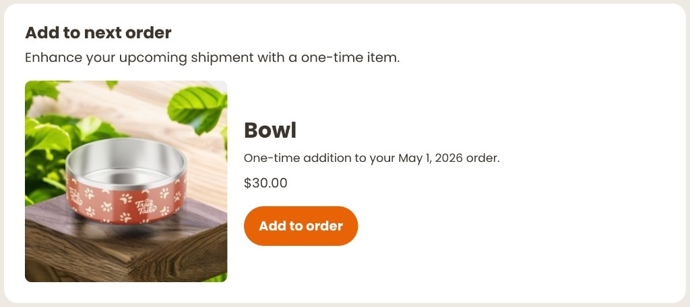

# Add to Next Order
tag: `rc-add-onetime`



Lets customers add a single product to their upcoming charge without starting a new subscription. The card hides itself once the item is already in the order, so it never shows a duplicate prompt.

## What it does

- Shows a product card with image, title, price, and scheduled charge date
- Customer taps "Add to order" to include the item in their next charge with one click
- Card disappears immediately after a successful add, keeping the portal uncluttered
- Hidden silently if the item is already in the upcoming order

## Configuration

| Constant | Description |
|---|---|
| `VARIANT_ID` | Shopify variant ID of the product to offer |
| `AFF_CSS` | Paste `AFF_CSS` from [`css-constants.js`](../css-constants.js) |
| `TW_CSS` | Paste `TW_CSS` from [`css-constants.js`](../css-constants.js) |

```js
const VARIANT_ID = 'YOUR_VARIANT_ID'; // CUSTOMIZE: your variant ID
```

## How it works

On mount the extension authenticates via the Recharge JS SDK and fires two parallel requests: one for the customer's next queued charge (address ID and scheduled date) and one to look up the product by variant ID. If the variant is already in the charge's line items the component hides itself and returns early. Otherwise it renders the product card. On add, it calls `createOnetime` with `{ commit: true }` so the change is applied to the queued charge immediately. Failures surface an inline error state with a retry button.
