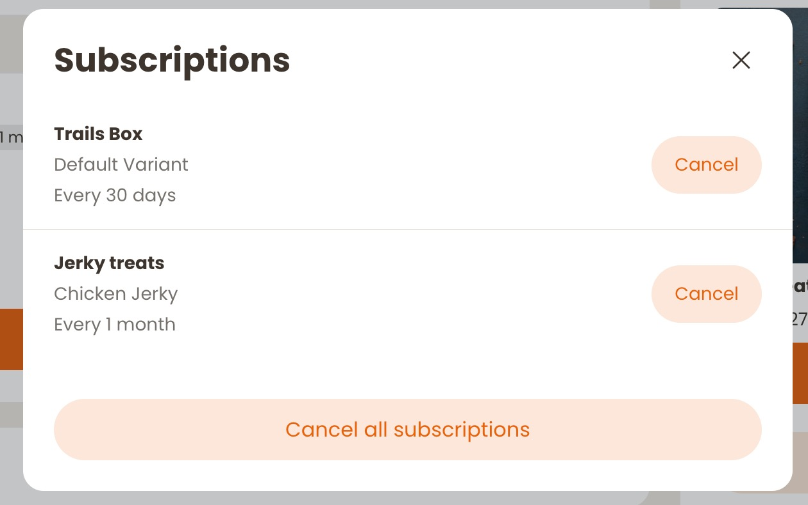
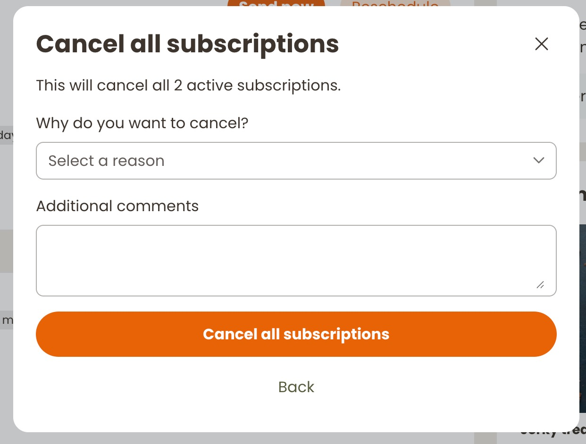

# Cancel Subscription

tag: `recharge-cancel-subscription`






Gives eligible customers a cancellation entry point in the Recharge customer portal. Customers with one active subscription go directly to Recharge's churn experience. Customers with multiple subscriptions can select an individual subscription, or optionally cancel all subscriptions in a single flow.

## What it does

- Shows a cancellation link only when the customer has active subscriptions
- Can restrict visibility by US state, based on the customer's subscription address
- Sends individual cancellations through Recharge's churn landing page
- Offers a cancel-all flow for customers with multiple subscriptions
- Loads the merchant's configured cancellation reasons and records the selected reason and comments

## Configuration

| Setting | Description |
|---|---|
| `EXTENSION_CONFIG.cancelAll` | Set to `true` to offer the bulk "Cancel all subscriptions" flow for customers with more than one active subscription. |
| `EXTENSION_CONFIG.textAlign` | Alignment for the cancellation link: `left`, `center`, or `right`. |
| `EXTENSION_CONFIG.allowedUSStates` | An array of USPS state codes permitted to see the extension. Use `[]` for all customers. |
| `STORE_IDENTIFIER` | Shopify domain used to initialize the Recharge SDK, for example `your-store.myshopify.com`. |
| `STOREFRONT_ACCESS_TOKEN` | Storefront access token used to initialize the Recharge SDK. |
| `AFF_CSS` and `TW_CSS` | Paste the shared framework constants from [`css-constants.js`](../css-constants.js). |

```js
const EXTENSION_CONFIG = Object.freeze({
  cancelAll: true,
  textAlign: 'center',
  allowedUSStates: [] // Show the extension to customers in all states.
});
```

Before publishing the sample, replace `STORE_IDENTIFIER` and `STOREFRONT_ACCESS_TOKEN` with the values for the destination store.

The extension has no component-specific CSS. Paste `AFF_CSS` and `TW_CSS` from [`css-constants.js`](../css-constants.js) into the empty constants at the top of the JavaScript file. They are injected once per page using the standard `#aff-framework` and `#tw-css` guards.

## How it works

On mount, the extension initializes the Recharge JavaScript SDK and loads the customer's active subscriptions with their addresses. If a state restriction is configured, it verifies that at least one subscription address matches.

For a single subscription, the cancel link requests a Recharge churn landing-page URL and redirects the customer there. For multiple subscriptions, the extension displays a modal list. The optional bulk flow loads survey reasons, collects a reason and comment, groups subscriptions by address, and commits cancellation updates in batches of 20.

After a successful bulk cancellation, it hides the extension and dispatches `Affinity:refresh` so the customer portal can refresh related sections.

## Add it to the customer portal

1. Host `rc-cancel-subscription.js` where it is accessible to the customer portal.
2. In Recharge, open **Storefront** > **Customer portal** > theme > **Home page** > **Customize**.
3. Add a **Custom extension** section and enter the hosted file URL.
4. Set the tag name to `recharge-cancel-subscription`.
5. Save, position the extension, and enable visibility for customers when ready.
