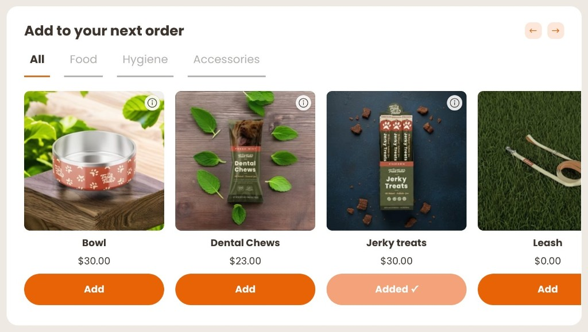

# rc-product-carousel

A horizontally scrollable product carousel with tag-based tab filtering and a product detail modal, letting customers add any item as a one-time addition to their next charge.

## What it does

- Fetches all Recharge products and the customer's next queued charge in parallel
- Organizes products into tabs based on Shopify tags (configurable — see Configuration below)
- Renders a scrollable carousel with prev/next arrow buttons
- Marks items already in the upcoming charge as "Added ✓" and disables their buttons
- Tapping a product image opens a detail modal with a full image gallery, description, and an add button
- Adds items as one-time line items with `{ commit: true }` and dispatches `Affinity:refresh` after each add
- Shows a loading spinner while fetching and an error state with retry on failure

## Screenshots



## Configuration

Open `rc-product-carousel.js` and update the constants at the top of the file.

| Constant | What to put here |
|---|---|
| `TAB_TAGS` | Object mapping tab keys to Shopify product tag strings. Each key must match a Shopify tag applied to your products. |
| `TABS` | Array of `{ key, label }` objects defining the tabs shown in the UI. The `all` entry should always be present. |
| `AFF_CSS` | Paste the `AFF_CSS` value from `css-constants.js` |
| `TW_CSS` | Paste the `TW_CSS` value from `css-constants.js` |

**Example** — if your products are tagged `dog-food`, `treats`, and `accessories`:

```js
const TAB_TAGS = {
  food:        'dog-food',
  treats:      'treats',
  accessories: 'accessories',
};

const TABS = [
  { key: 'all',         label: 'All' },
  { key: 'food',        label: 'Food' },
  { key: 'treats',      label: 'Treats' },
  { key: 'accessories', label: 'Accessories' },
];
```

Also update the `#products` initial value and the `refresh()` reset to match your tab keys (search for `// CUSTOMIZE` comments in the file).

## CSS setup

Paste the contents of `AFF_CSS` and `TW_CSS` from [`css-constants.js`](../css-constants.js) directly into the matching constants at the top of `rc-product-carousel.js`. No hosting required.

Alternatively, host `skills/affinity-framework/assets/aff-framework.css` and `skills/affinity-framework/assets/tw.css` on your own CDN and swap the `<style>` injection in `connectedCallback` to `<link>` tags. See `skills/affinity-framework/SKILL.md` for the pattern.

## How it works

On mount the extension authenticates with the Recharge SDK and fires two parallel requests: a product search (up to 50 products) and a fetch of the next queued charge. Tab filtering is applied client-side by matching product tags against `TAB_TAGS`. Already-added variants are tracked in a `Set` and reflected on buttons without a full re-render — only the carousel track re-renders on tab changes. The product detail modal is built and injected into the component DOM on demand and removed after its close animation completes.

Tag name: `rc-product-carousel`
