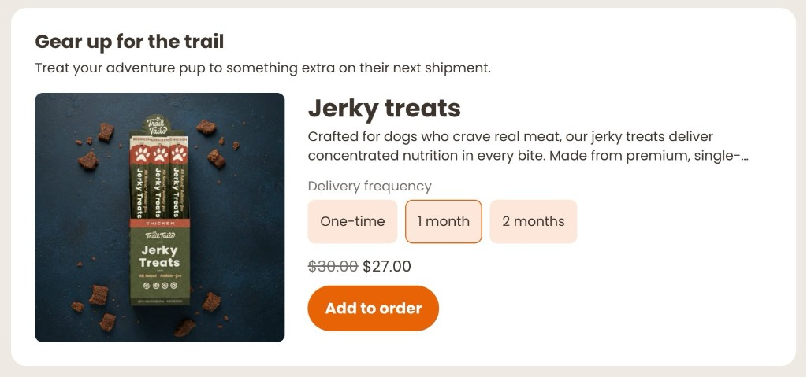

# Product Offer
tag: `rc-product-offer`



Presents a single product as an add-on to the customer's next order, with optional variant and delivery frequency selectors. Supports both one-time and subscription plans side by side. Hides automatically when any variant of the product is already in the upcoming charge.

## What it does

- Shows a product card with image, name, optional description, and price
- Adapts layout based on container width: stacked on narrow containers, image-beside-content above 480 px
- Variant selector renders one pill group per product option (e.g. Size, Color) — only shown when the product has multiple variants and `SHOW_VARIANT_SELECTOR` is true
- Delivery frequency selector shows one-time and subscription plans as radio pills, sorted shortest-to-longest — only shown when subscription plans exist and `SHOW_PLAN_SELECTOR` is true
- Subscription price displays with one-time price as strikethrough when a discount applies
- Hides silently when any variant of the product is already in the upcoming charge
- Dispatches `Affinity:refresh` after a successful add so the rest of the portal updates

## Configuration

| Constant | Description |
|---|---|
| `DEFAULT_VARIANT_ID` | Any variant ID belonging to the target product. Used as a lookup key and as the pre-selected variant when the selector is hidden |
| `DEFAULT_PLAN` | Pre-selected plan: `'onetime'` or `'subscription'`. Used directly when `SHOW_PLAN_SELECTOR` is false |
| `SHOW_VARIANT_SELECTOR` | `true` to show per-option pill selectors; `false` to lock to `DEFAULT_VARIANT_ID` |
| `SHOW_PLAN_SELECTOR` | `true` to show delivery frequency pills; `false` to lock to `DEFAULT_PLAN` |
| `INTRO_HEADING` | Heading shown above the product card |
| `INTRO_BODY` | Body copy shown below the heading |
| `PRODUCT_DESCRIPTION` | Override the product description string, or `null` to auto-derive from the first two sentences of the product's `body_html` |
| `AFF_CSS` | Paste `AFF_CSS` from [`css-constants.js`](../css-constants.js) |
| `TW_CSS` | Paste `TW_CSS` from [`css-constants.js`](../css-constants.js) |

```js
const DEFAULT_VARIANT_ID    = 'YOUR_VARIANT_ID'; // CUSTOMIZE: any variant ID from the target product
const DEFAULT_PLAN          = 'onetime';          // CUSTOMIZE: 'onetime' or 'subscription'
const SHOW_VARIANT_SELECTOR = true;               // CUSTOMIZE: false to hide the variant selector
const SHOW_PLAN_SELECTOR    = true;               // CUSTOMIZE: false to hide the delivery frequency selector
const INTRO_HEADING         = 'Add to next order';
const INTRO_BODY            = 'Enhance your upcoming shipment with a one-time item.';
const PRODUCT_DESCRIPTION   = null;
```

`AFF_CSS` and `TW_CSS` hold the framework styles — copy them from [`css-constants.js`](../css-constants.js). See the [main README](../README.md) for full setup instructions.

## How it works

On mount the extension authenticates via the Recharge JS SDK and fires two parallel requests: one for the customer's next queued charge (to get the address ID and scheduled date) and one to look up the product by `DEFAULT_VARIANT_ID`. If any variant of the product is already in the charge's line items the component hides itself and returns early.

Product options and variants are normalised from the API response. Plans are sorted with one-time first, then subscriptions by frequency ascending. Each variant's price is keyed by plan ID so the displayed price updates instantly when the customer switches plans or variants.

On add, `createOnetime` is called for one-time selections and `createSubscription` with `{ commit: true }` for subscription selections, both including `next_charge_scheduled_at` so the item is attached to the next queued charge. After a successful add the widget hides itself and dispatches `Affinity:refresh`.
