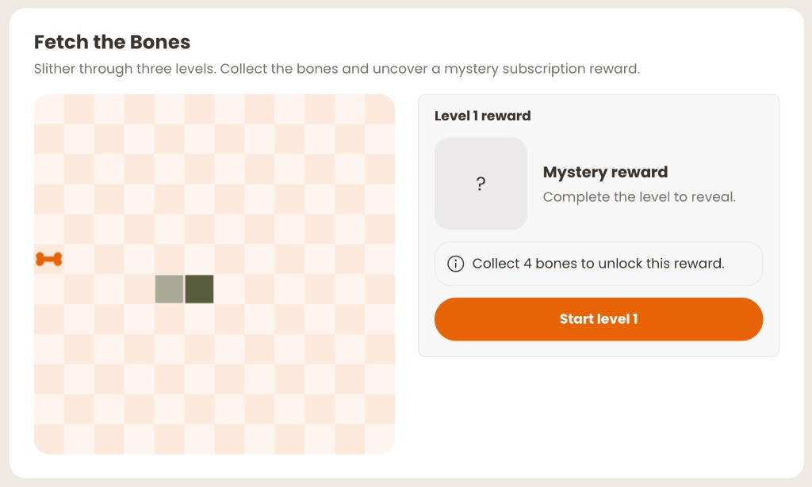
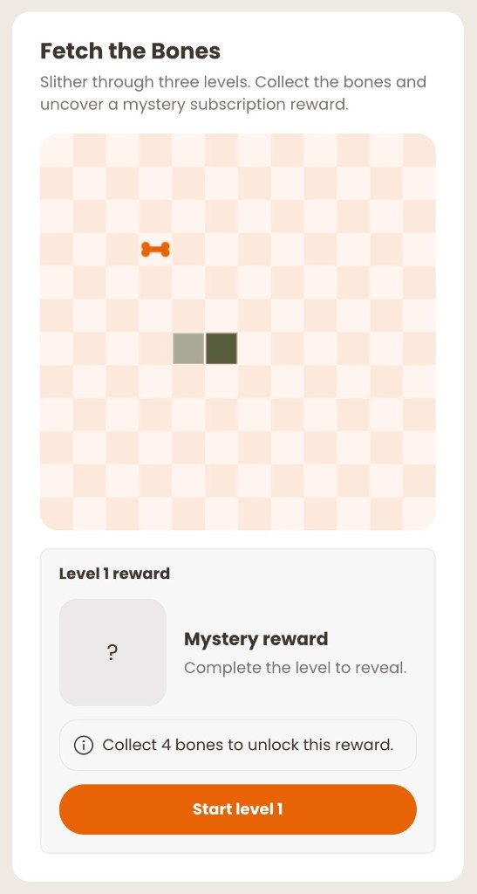
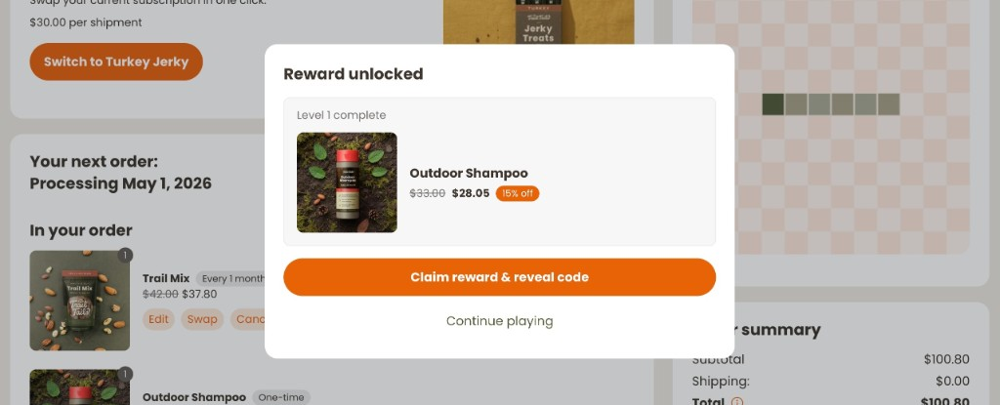

# rc-subscriptions-snake

A playable Snake mini-game that rewards customers with escalating subscription discounts as they complete progressively harder levels.

## What it does

- Renders a three-level Snake game on a canvas element alongside a reward preview panel
- At the start each level shows a "mystery reward" card — the actual product is revealed only after the level is cleared
- Reward products are fetched from Recharge and shuffled at runtime; any product that supports both one-time and subscription purchase is eligible
- Clearing a level reveals the reward product, shows the discounted price, and lets the customer claim their discount code
- Three configurable discount tiers, one per level, are defined as top-of-file constants
- The board is responsive via CSS Container Queries — side-by-side layout at ≥ 600 px, stacked below that
- Arrow key and on-screen button controls are both supported
- `// BRAND:` and `// CUSTOMIZE:` comments mark copy and art that should be updated for your store

## Screenshots

## Configuration

Open `rc-subscriptions-snake.js` and update the constants at the top of the file.

| Constant | What to put here |
|---|---|
| `DISCOUNT_TIERS` | Human-readable reward labels shown in the UI, e.g. `['10% off', '20% off', '30% off']` |
| `DISCOUNT_CODES` | The actual discount codes customers will copy, one per level |
| `DISCOUNT_PERCENTS` | Numeric percentages used to calculate the discounted price shown in the reward modal |
| `AFF_CSS` | Paste the `AFF_CSS` value from `css-constants.js` |
| `TW_CSS` | Paste the `TW_CSS` value from `css-constants.js` |

Search the file for `// BRAND:` and `// CUSTOMIZE:` comments to update store-specific copy (headings, progress text, collectible shape drawn on the board).

**Note on reward products:** the extension automatically picks three eligible products from your Recharge catalogue at runtime. No manual product configuration is needed — any product with both a subscription plan and a one-time price is eligible.

## CSS setup

Paste the contents of `AFF_CSS` and `TW_CSS` from [`css-constants.js`](../css-constants.js) directly into the matching constants at the top of `rc-subscriptions-snake.js`. No hosting required.

Alternatively, host `skills/affinity-framework/assets/aff-framework.css` and `skills/affinity-framework/assets/tw.css` on your own CDN and swap the `<style>` injection in `connectedCallback` to `<link>` tags. See `skills/affinity-framework/SKILL.md` for the pattern.

## How it works

On mount the extension authenticates with the Recharge SDK and runs a product search for up to 250 products. It filters for those that support both subscription and one-time purchase, shuffles the result, and picks the first three as rewards. The game loop runs in a `setInterval` that calls `tick()` each frame. `tick()` applies the current direction to the snake head, checks for collisions with walls or the snake's own body, consumes the apple if reached, and transitions to the `reward` phase when the apple target for the level is met. State is held in a plain object on the class instance and `render()` is called after every state change. The canvas is redrawn via the 2D API in `drawBoard()`.

Tag name: `rc-subscriptions-snake`
