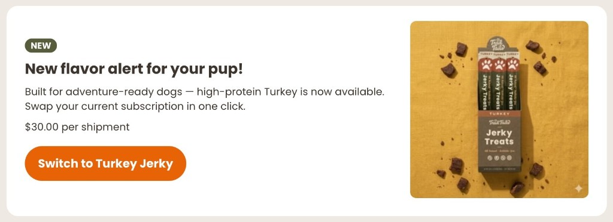

# Swap Offer
tag: `rc-swap-offer`



Shows a targeted upgrade offer to customers who are subscribed to a specific product but haven't yet switched to the target variant. One click updates their subscription in place — no cancellation or re-subscribe needed.

## What it does

- Shown only to customers who have an active subscription on the configured source product
- Hidden automatically if the customer is already on the target variant
- Displays the target variant's image, price, and configurable badge, headline, and body copy
- Customer clicks the CTA to switch their subscription variant immediately

## Configuration

| Constant | Description |
|---|---|
| `SOURCE_PRODUCT_ID` | Shopify product ID of the subscription the customer is currently on |
| `TARGET_VARIANT_ID` | Shopify variant ID to swap the subscription to |
| `AFF_CSS` | Paste `AFF_CSS` from [`css-constants.js`](../css-constants.js) |
| `TW_CSS` | Paste `TW_CSS` from [`css-constants.js`](../css-constants.js) |

```js
const SOURCE_PRODUCT_ID = 'YOUR_SOURCE_PRODUCT_ID'; // CUSTOMIZE: source product
const TARGET_VARIANT_ID = 'YOUR_TARGET_VARIANT_ID'; // CUSTOMIZE: target variant
```

Search for `// CUSTOMIZE:` comments in `_render()` to update the badge text, headline, body copy, and button label.

## How it works

On mount the extension authenticates with the Recharge SDK and fetches the customer's active subscriptions. It looks for one where `external_product_id.ecommerce` matches `SOURCE_PRODUCT_ID` and `external_variant_id.ecommerce` is not already `TARGET_VARIANT_ID`. If none is found the extension hides itself and returns. Otherwise it fetches product details for `TARGET_VARIANT_ID` and renders the offer card. On confirmation it calls `updateSubscription` with `{ commit: true }` to apply the change immediately.
